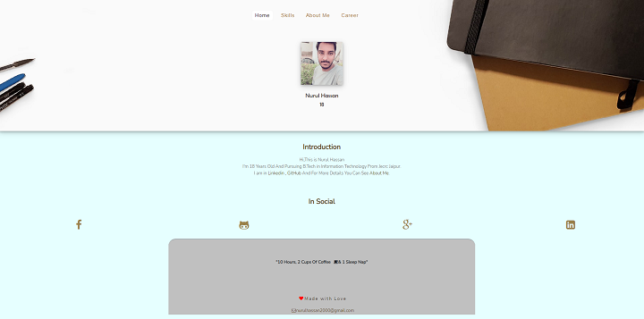

<h1 align="center">
  nurulhassan - v1
</h1>

  The First iteration of <a href="https://nurulhassan.tech/" target="_blank">nurulhassan</a> built with HTML5, CSS3, Javascript and Bootstrap.

## 🚨 Forking this repo (please read!)

Many people have contacted me asking me if they can use this code for their own website, and the answer to that question is usually **yes, with attribution**.

I value keeping my site open source, but as you all know, _**plagiarism is bad**_. It's always disheartening whenever I find that someone has copied my site without giving me credit. I spent a non-trivial amount of effort building and designing this iteration of my website, and I am proud of it! All I ask of you all is to not claim this effort as your own.
